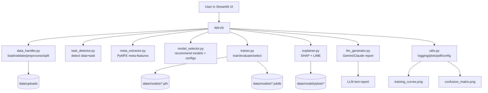

# Codebase Architecture

This document describes how the Intelligent Deep Learning Model Recommender is organized and how data moves through the system.

## 1. High-Level Architecture

## 2. Layered View

1. Presentation Layer
- app.py: Streamlit workflow and orchestration for all steps.

2. Core Intelligence Layer
- task_detector.py: identifies data/task type.
- meta_extractor.py: derives tabular meta-features.
- model_selector.py: maps task type to candidate deep learning architectures and training configs.

3. Learning Layer
- trainer.py: Optuna tuning, training loops, early stopping, checkpointing, evaluation.

4. Explainability + Narrative Layer
- explainer.py: SHAP and LIME artifacts.
- llm_generator.py: converts metrics/XAI outputs into natural-language report.

5. Infrastructure Layer
- data_handler.py: ingestion, validation, preprocessing, split logic.
- utils.py: config loading, plotting, logging, PDF utility.
- config.yaml: runtime knobs (paths, epochs, patience, trials, LLM provider).

## 3. End-to-End Runtime Flow

1. Data enters via app.py upload widget.
2. data_handler.py loads raw data and validates schema/content.
3. task_detector.py infers data_type and task_type.
4. meta_extractor.py computes tabular meta-features (if applicable).
5. model_selector.py recommends architectures and returns candidate hyperparameter configs.
6. data_handler.py preprocesses + splits into train/val/test.
7. trainer.py:
   - runs Optuna objective per selected config,
   - trains final model with best trial params,
   - applies early stopping,
   - saves model and preprocessors,
   - returns validation metrics/history.
8. trainer.py selects best model and evaluates on test split.
9. explainer.py generates SHAP/LIME files for tabular classification.
10. llm_generator.py builds AI report from metrics + explainability outputs.
11. utils.py renders and saves visual artifacts and optional PDF output.

## 4. Main Code Ownership (by file)

- app.py
  - Orchestrates the 7-step UI flow and session state.
  - Calls all domain modules in sequence.

- src/data_handler.py
  - load_data, validate_data, preprocess_data, split_data.
  - Handles tabular/image/text input pipelines.

- src/task_detector.py
  - TaskInfo dataclass and detection heuristics.

- src/meta_extractor.py
  - extract_meta_features for tabular data using PyMFE.

- src/model_selector.py
  - TabularANN and LSTMTimeSeries model classes.
  - recommend_model, generate_configs, build_tabular_model.

- src/trainer.py
  - train_models, select_best_model, evaluate_model.
  - Persists .pth, .json, and preprocessing artifacts.

- src/explainer.py
  - generate_shap_explanation, generate_lime_explanation, generate_xai_results.

- src/llm_generator.py
  - Prompt construction and provider-specific generation.
  - Fallback report when API keys/calls fail.

- src/utils.py
  - setup_logging, load_config, plotting helpers, PDF export helper.

## 5. Artifacts and Persistence

- Input files: data/uploads/
- Trained weights: data/models/best_model_cfg*_*.pth
- Model metadata: data/models/best_model_cfg*_*.json
- Preprocessing artifacts: data/models/preprocessor_*.joblib, target_encoder_*.joblib
- Explainability plots/html: data/models/plots/

## 6. Important Implementation Notes

- Current training/evaluation pipeline is fully implemented for tabular data.
- Image/text branches are currently recommendation-focused in UI.
- Explainability flow is focused on tabular classification in this release.
- Optuna + early stopping are central to model-selection quality.
